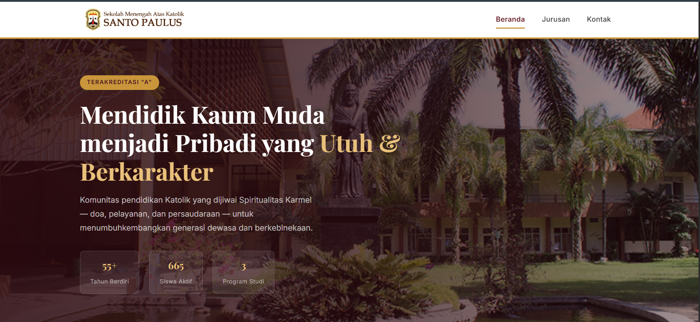
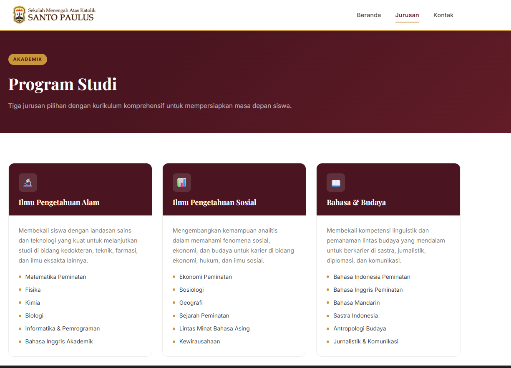
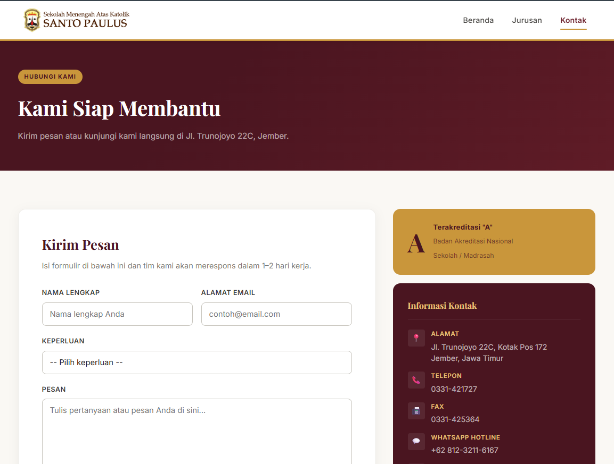

## Pembuatan Website Sekolah dengan HTML

## Biodata Mahasiswa

Nama : Asher Yedijah Hoesono  
NRP : 5025251106  
Kelas : Pemrograman Web (B)

## Dokumentasi

Link Github: https://github.com/AsherYedi/PemrogramanWeb_Asher-Yedijah-Hoesono_5025251106/tree/main/Pertemuan%203

Link Website: https://smakstpaul.vercel.app

Sumber: https://saintpauljember.sch.id/

Deskripsi:
Website SMA Katolik Santo Paulus Jember merupakan proyek landing page sekolah yang dirancang untuk menampilkan profil sekolah secara modern, informatif, dan mudah diakses. Website ini dibuat dengan HTML, CSS, dan JavaScript untuk memberikan informasi mengenai visi, misi, program studi, serta kontak sekolah kepada siswa, orang tua, dan masyarakat umum. Tampilan yang sederhana namun elegan bertujuan untuk memperkuat branding sekolah dan memudahkan pengunjung dalam mencari informasi penting.

Fitur:

- Halaman Beranda yang menampilkan profil sekolah, sambutan kepala sekolah, visi dan misi, serta statistik sekolah.
- Halaman Jurusan yang berisi informasi mengenai program studi IPA, IPS, dan Bahasa & Budaya beserta mata pelajaran yang relevan.
- Halaman Kontak yang menyediakan informasi alamat, telepon, WhatsApp, dan formulir pengiriman pesan.
- Navigasi halaman yang mudah dipahami dengan menu utama Beranda, Jurusan, dan Kontak.
- Desain responsif dan menarik dengan penggunaan layout yang rapi serta elemen visual seperti logo, ikon, dan card section.
- Formulir kontak yang dapat digunakan untuk mengirim pesan atau pertanyaan kepada pihak sekolah.
- Struktur website multi-page yang terorganisir dan mudah dikembangkan lebih lanjut.

## Tampilan Website

1. Home  
   

2. Jurusan
   

3. Kontak
   
