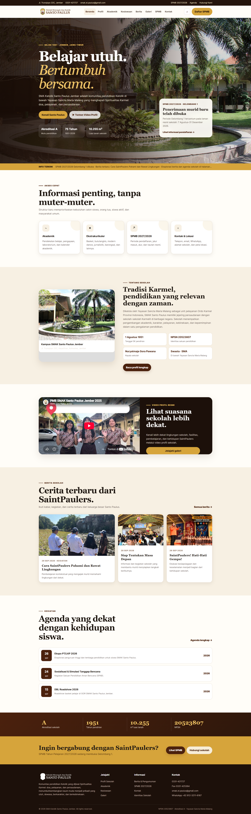
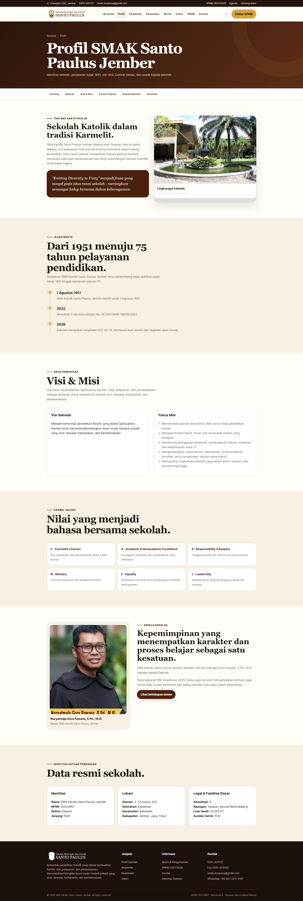

# Laporan Singkat Pengerjaan Website dan PRD

## SMA Katolik Santo Paulus Jember

### Biodata

Nama : Asher Yedijah Hoesono  
NRP : 5025251106  
Kelas : Pemrograman Web (B)

Link Website: https://stpauldummy.vercel.app  
Link PRD : [Product Requirements Document](dokumen/PRD_SMAK_Santo_Paulus_Jember.md)

### 1. Riset

Pengerjaan diawali dengan mencari informasi mengenai SMA Katolik Santo Paulus Jember dari website resmi sekolah dan sumber pendidikan resmi. Informasi yang dikumpulkan meliputi profil sekolah, akademik, kesiswaan, prestasi, SPMB, kontak, dan dokumentasi sekolah.

### 2. Pembuatan PRD

Setelah informasi terkumpul, dibuat Product Requirements Document (PRD) sebagai acuan pengembangan website.

PRD berisi:

- Tujuan website
- Target pengguna
- Struktur halaman
- Fitur utama
- Kebutuhan tampilan
- Batasan proyek

Halaman utama yang direncanakan adalah:

- Beranda
- Profil
- Akademik
- Kesiswaan
- Berita
- Galeri
- SPMB
- Kontak

### 3. Pembuatan Website

Website kemudian dibuat berdasarkan PRD dan wireframe.

Tahapan pengerjaan:

1. Membuat struktur halaman.
2. Membuat navigasi antarhalaman.
3. Menambahkan konten hasil riset.
4. Menambahkan foto dan video profil.
5. Membuat tampilan yang konsisten dan responsif.
6. Menambahkan fitur interaktif seperti pencarian, filter galeri, FAQ, dan menu mobile.

### 4. Pengujian

Setelah website selesai, dilakukan pengecekan terhadap:

- Navigasi
- Tampilan desktop dan mobile
- Link antarhalaman
- Gambar dan video
- Fitur interaktif
- Konsistensi informasi

### 5. Hasil Akhir

Hasil akhir berupa website profil SMA Katolik Santo Paulus Jember yang memiliki informasi profil, akademik, kesiswaan, berita, galeri, SPMB, dan kontak serta dapat digunakan pada berbagai ukuran layar.

### Tampilan Web

  

