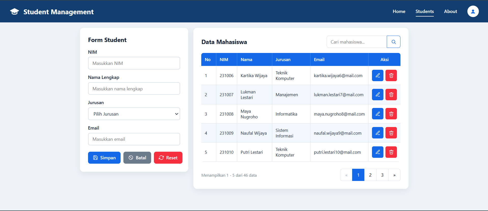

# Pertemuan 5 – Student Management (HTML + CSS + JavaScript)

**Nama:** Asher Yedijah Hoesono  
**NRP:** 5025251106  
**Mata Kuliah:** Pemrograman Web  
**Pertemuan:** 5

---

## 📋 Deskripsi

Proyek ini merupakan aplikasi **Student Management** berbasis web yang dibangun menggunakan HTML, CSS, dan JavaScript murni (tanpa framework). Aplikasi ini memungkinkan pengguna untuk mengelola data mahasiswa secara lengkap melalui antarmuka yang responsif dan modern.

---

## 🎯 Tujuan Pembelajaran

- Memahami dan menerapkan **CSS Variables** untuk konsistensi desain
- Menggunakan **Flexbox** dan **CSS Grid** untuk layout halaman
- Membangun **komponen UI** reusable (Card, Button, Form, Table, Pagination)
- Mengimplementasikan **CRUD** (Create, Read, Update, Delete) menggunakan JavaScript
- Menyimpan data di **localStorage** browser
- Membuat tampilan **responsif** dengan media queries

---

## 🗂️ Struktur File

```
Pertemuan 5/
├── index.html          → Struktur halaman utama
├── css/
│   └── style.css       → Seluruh styling dan komponen CSS
├── js/
│   └── app.js          → Logika CRUD, search, dan pagination
└── README.md           → Laporan pengerjaan
```

---

## ⚙️ Fitur Aplikasi

| Fitur               | Keterangan                                                                      |
| ------------------- | ------------------------------------------------------------------------------- |
| **Tambah Data**     | Input NIM, Nama, Jurusan, dan Email lalu klik Simpan                            |
| **Edit Data**       | Klik tombol ✏️ pada baris tabel untuk mengedit data mahasiswa                   |
| **Hapus Data**      | Klik tombol 🗑️ disertai konfirmasi sebelum data dihapus                         |
| **Cari Data**       | Pencarian real-time berdasarkan NIM, Nama, Jurusan, atau Email                  |
| **Pagination**      | Data ditampilkan 5 baris per halaman dengan navigasi halaman                    |
| **Validasi Form**   | NIM (numerik 4–15 digit, unik), Nama, Jurusan wajib dipilih, format Email valid |
| **Persistent Data** | Data tersimpan di `localStorage` sehingga tidak hilang saat refresh             |
| **Responsif**       | Layout menyesuaikan layar mobile (< 650px) dan tablet (< 950px)                 |

---

## 🎨 Struktur CSS

### CSS Variables (`style.css` baris 16–25)

Mendefinisikan token desain global yang digunakan di seluruh stylesheet:

```css
:root {
  --primary: #1469e8;
  --primary-dark: #0f4fae;
  --danger: #f52f3d;
  --secondary: #6c7b8b;
  --border: #d9e0e8;
  --text: #182235;
  --surface: #ffffff;
  --radius: 14px;
}
```

### Komponen CSS yang Dibuat

| No  | Komponen               | Teknik Layout | Keterangan                                         |
| --- | ---------------------- | ------------- | -------------------------------------------------- |
| 1   | **CSS Reset & Global** | —             | `box-sizing`, `font-family`, background global     |
| 2   | **CSS Variables**      | —             | Token warna, radius, dsb.                          |
| 3   | **Navbar**             | Flexbox       | `justify-content: space-between` antar brand & nav |
| 4   | **Layout Utama**       | CSS Grid      | `grid-template-columns: 380px 1fr` (form \| tabel) |
| 5   | **Card**               | —             | Kontainer dengan shadow, border-radius, padding    |
| 6   | **Form Student**       | Block         | Label, input, select, error message, focus state   |
| 7   | **Button**             | Inline-flex   | `.btn-primary`, `.btn-secondary`, `.btn-danger`    |
| 8   | **Search Box**         | Flexbox       | Input + tombol ikon bergabung dalam satu baris     |
| 9   | **Table**              | —             | `border-collapse: separate`, zebra striping, hover |
| 10  | **Action Button**      | Grid          | Tombol edit/hapus di dalam sel tabel               |
| 11  | **Pagination**         | Flexbox       | Tombol prev / angka halaman / next                 |
| 12  | **Responsive**         | Media Query   | Breakpoint 950px (1 kolom) & 650px (mobile)        |

---

## 📸 Screenshot Website

### Tampilan Utama



---
